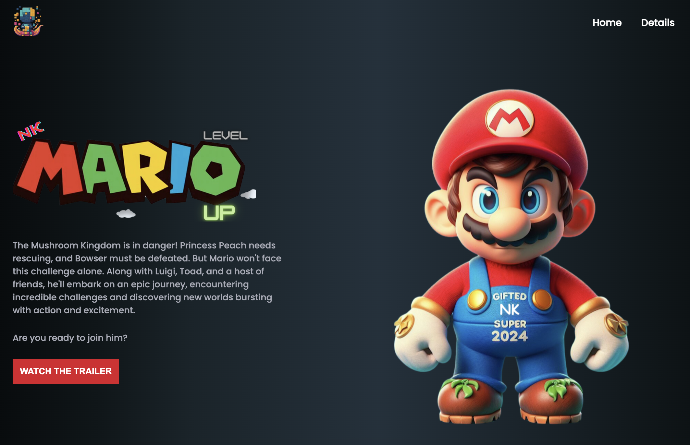

# 🎮 Mario Game Dev | Be Ready for the Next Release: Movie, Games, and Anime Trailers!

Welcome to the **Mario Game Dev** project!  
This web-based platform showcases the latest trailers for movies, games, and anime — all styled with the charm of the Mario universe.

---

## 📑 Table of Contents

- [🎬 Demo](#demo)
- [✨ Features](#features)
- [🛠 Installation](#installation)
- [🚀 Usage](#usage)
- [📁 Project Structure](#project-structure)
- [🎨 Customization](#customization)
- [🤝 Contributing](#contributing)
- [🧾 License](#license)
- [🙏 Acknowledgements](#acknowledgements)
- [📞 Contact](#contact)

---

## 🎬 Demo



👉 **Live Demo: https://worachat-dev.github.io/Landing-Page-Game-Dev-Profiles/**

---

## ✨ Features

- 🎨 **Modern Web Design:** Sleek, responsive layout with vibrant Mario-themed aesthetics.
- 📺 **Trailer Playback:** Embedded video player for watching the latest movie, game, and anime trailers.
- 🍄 **Mario-Themed UI:** Engaging visuals with characters, backgrounds, and design inspired by the Mario universe.

---

## 🛠 Installation

To set up the project locally:

1. **Clone the Repository**

   ```bash
   git clone https://github.com/your-username/your-repo.git
   cd your-repo
   ```

2. **Install Dependencies**

   ```bash
   npm install
   ```

---

## 🚀 Usage

### Development

```bash
npm start
```

Open [http://localhost:3000](http://localhost:3000) in your browser.

### Production Build

```bash
npm run build
```

The optimized build will be in the `dist/` folder (or your configured output).

---

## 📁 Project Structure

```
.
├── src
│   ├── css
│   │   ├── reset.css
│   │   ├── style.css
│   │   └── responsive.css
│   ├── images
│   │   ├── contentcove-icon.ico
│   │   ├── mario-logo.png
│   │   ├── super-mario-bros-title.png
│   │   ├── super-mario-chars.png
│   │   └── screenshot.png
│   ├── js
│   │   └── index.js
│   ├── index.html
│   └── ...
```

---

## 🎨 Customization

Feel free to adapt the project:

* Update styles in `style.css` and `responsive.css`
* Modify layout/content in `index.html`

### 🔳 Video Modal Example

```css
.video-modal {
  display: none;
  justify-content: center;
  align-items: center;
  position: fixed;
  top: 0;
  left: 0;
  width: 100%;
  height: 100%;
  background-color: rgba(0, 0, 0, 0.8);
  z-index: 1000;
}

.video-container {
  position: relative;
  width: 100%;
  max-width: 700px;
}

.video-container video {
  width: 100%;
  height: auto;
}

.close-btn {
  position: absolute;
  top: 10px;
  right: 10px;
  background: #fff;
  border: none;
  border-radius: 50%;
  width: 30px;
  height: 30px;
  display: flex;
  justify-content: center;
  align-items: center;
  font-size: 20px;
  cursor: pointer;
}
```

---

## 🤝 Contributing

Contributions are welcome!
Feel free to open issues or submit pull requests for improvements and bug fixes.

---

## 🧾 License

This project is licensed under the **MIT License**.
See the [LICENSE](LICENSE) file for more details.

---

## 🙏 Acknowledgements

This project is a modified version of [The\_Content-Cove\_Project](https://github.com/juletopi/The_Content-Cove_Project) by Júlio Cézar.

* 👤 [Júlio Cézar](https://github.com/juletopi) for the original base project.
* 🎮 [Nintendo](https://www.nintendo.com/) for Mario and related characters.

---

## 📞 Contact

👨‍🏫 **Worachat Wannawong, Ph.D.**
🔗 [GitHub Profile](https://github.com/worachat-dev)

---

